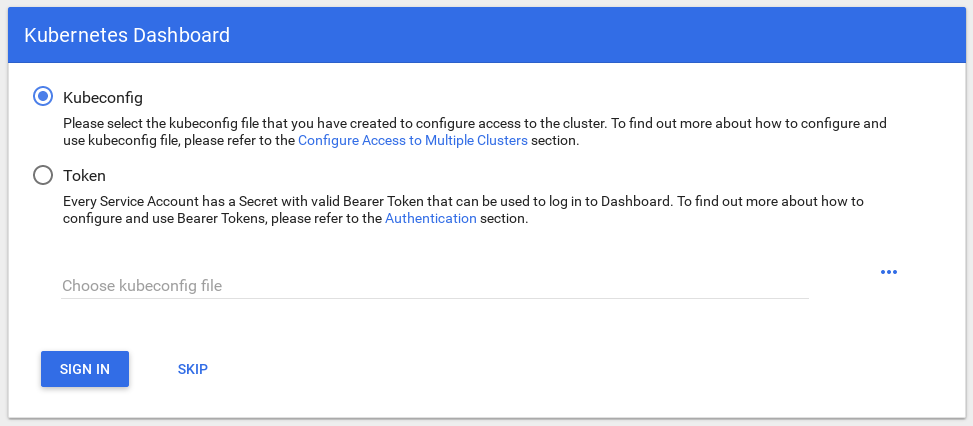

# Finnaly, we can use Kubernetes...
Depending on the install method, current version or environment of your install, Kubernetes is a different beast to tame. The additition of (default) RBAC and not yet updated documentation can make you feel like Alice falling into a rabbit-hole. Best to keep focus on what you want to achieve, how and,when shared with others, if it will be sustainable and maintainable for others.


## Are we there yet..?
First we'll outline the different networtk and authentication methods we'll be using:
- [x] For networking and network (policy) Canal (Calico/Flannel) was implement when following [the previous part](KubernetesInstall.md)
- [ ] Connecting and authenticating, administrative access

## Proxy access
Kubernetes is build upon abstractions, which in theory make it more fit for purpose, abstracting some of the cluster complexity away from the 'normal' user. Depending on what you want to achieve with your Kubernetes setup there are overwhelming amounts of choices to make. Depending on the tooling you want to use at an higher abstraction, some choices are dictated, simply because the tooling is opinionated or the tooling is simply not ready to make use of yet another change to the Kubernets default install. Let alone all dialects of Kubernetes provided by different vendors (Openshift and CSP specific Kubernetes setups..).

Basic proxy distiction can be made:
- cluster adminstration through Dashboard (using loclahost routing via kubectl proxy) and cluster administration API proxies for API access
- pod/cluster networking proxies
- user proxies, publishing proxies

In turn all these proxies have differering limitations and/or requirements for setting up authentication. This is where a Kubernetes cluster-as-a-Service really looks very tempting, as they offer most of these options in a easy and configurable way. But it wouldn't be that much fun, building on a GKE is just a matter of being able to apply for a creditcard and filling out your billing details.

### Kubectl proxy for Dashboard access
First of we'll setup the dashboard for remote access. Since the introduction of RBAC (default on in recent versions of kubeadm), the Dashboard has some rights restricted. This results in a lot of access denied banners. To give a correct overview of your cluster in the Dashboard you have to login using an account with the correct priviledges (or implement the non-recommended "give Dashboard service the rights in RBAC to access cluster resources"-way).

- [x] Connect to Dashboard
- [ ] Setup correct Authentication and Authorization

We'll start of by enabling Dashboard connectivity through a local kubectl proxy command. If you are able to reach the standard kubectl proxy service from your workstation, you can use a local install of kubectl and simply proxy the Dashboard to a local port of choice on your local machine. 

Get the kubectl version corresponding to your cluster version, in the command prompt of your server just type in:

```
kubectl version
```

Just follow the instruction to install kubectl on your local workstation:
[https://kubernetes.io/docs/tasks/tools/install-kubectl/](https://kubernetes.io/docs/tasks/tools/install-kubectl/)

Now we start the setup of kubectl for remote access from your workstation. For this to work I selected the more insecure option of using the 'admin.conf' locally to authenticate. First of copy the current admin.conf from your cluster Master node to your local machine, the example is scp based (make sure there's no prior config or it will be overwritten!):
```
scp root@yourmaster:/etc/kubernetes/admin.conf .kube/config
```
Now you can run kubectl also from your local workstation command line, but to setup authentication from a webbrowser it gets more complicated. First of we need to select an Authentication provider, I've selected Google as my idp, based on OpenID Connect. For the TL;DR version just walk thorugh the next steps I'll try and create a blogpost with more details and reference.

**--NEXT STEPS--NOT READY YET--**
- [ ] Create user and setup role binding to 

Dashboard is not installed by default and needs to be setup with the following command:
```
kubectl create -f https://raw.githubusercontent.com/kubernetes/dashboard/master/src/deploy/recommended/kubernetes-dashboard.yaml
```
Then run the following command to proxy kubectl (and the Dashboard) to your loacalhost:8001 adress:
```
kubectl proxy
```
Then open Dashboard in a browser window by clciking [http://127.0.0.1:8001/api/v1/namespaces/kube-system/services/https:kubernetes-dashboard:/proxy/](http://127.0.0.1:8001/api/v1/namespaces/kube-system/services/https:kubernetes-dashboard:/proxy/)



As you can see in the screen shot, authentication needs to be setup. 

To enable this

## Ingress, NodePort, LoadBalancer, HostPort etc..
Publishing anything on Kubernetes is done via a Service, which gets coupled to a cluster resources like Pods (or also Service outside the cluster), to abstract away finding an available and correct Pod on Worker Nodes. 
Ingress pre works with HTTP, con works ONLY with HTTP
You need a controller I've selected the ingress-nginx kubernetes controller, which will act like a reverse proxy, getting requests to my Service and in turn to the correct Pod(s).
Other options: 
NodePort, mapping a (random) port on the Master which makes the Pod accesible on multiple Worker Nodes. For quick setup and demo an easy way to gain access to your published Pod 


## Orchestration Integration
Although Kubernets has already created a nice abstraction for orchestrating workloads, it's still very low-level or not as user friendly as it could be. The aim of Kubernetes is to become a 'boring' abstraction which more interesting layers can plug into. Here's where opinionation really takes of into another dimension and use-cases become more dominant. My current preference for easy deployable workloads is still Helm and it has a nice integration setup for the CI/CD tooling I want to integrate in one of the demo's. At some point I'll also dive deeper into Istio as a Service Manager (not in the ITSM-sense).
